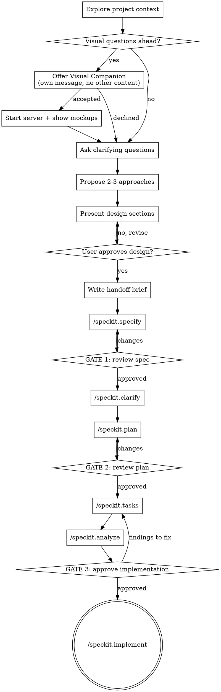

# Brainstorm → Spec-Kit Pipeline

Turn a feature idea into a validated design through collaborative dialogue, then drive the whole Spec Kit chain to implementation without the user manually invoking each step.

The `/speckit.*` commands are **not** part of this plugin. They come from [github/spec-kit](https://github.com/github/spec-kit), installed into the active repository by `jtl-init` Part D. If `.specify/` is missing, stop and tell the user to run `jtl-init`. Harnesses in skills mode expose the same steps as `$speckit-*`.

This skill replaces the terminal state of plain brainstorming. Plain brainstorming ends at "write a design doc". This one ends at shipped code, with `specs/NNN-<slug>/` as the single source of truth.

<HARD-GATE>
Do NOT write code, scaffold files, invoke an implementation skill, or invoke ANY speckit command until you have presented a design and the user has approved it. This applies to EVERY feature regardless of perceived simplicity.
</HARD-GATE>

<VISUAL-GATE>
If the feature touches any component, block, recipe, screen, layout, navigation, token, chart, or any question whose answer is a visual preference — you MUST send the Visual Companion offer (see below) BEFORE asking your second clarifying question. The offer is its own message with nothing else in it.

You may NOT proceed past the second clarifying question until either:
- the user accepted and you have started the server and shown at least one mockup, or
- the user explicitly declined.

Silently skipping this is the failure mode this skill exists to prevent. "The feature seemed obvious" is not an exemption.

For backend-only work the offer is optional — make it only when a diagram (data flow, state machine, entity relationships) would genuinely explain the design better than prose.
</VISUAL-GATE>

<MUST-FOLLOW>
Use `context-mode` MCP for read, search, and fetch — anything that requires understanding the current state of the codebase, docs, or recent work. From the main agent, dispatch `deep-explore` before raw Read/Grep/Glob exploration, batching all questions into one call.
</MUST-FOLLOW>

## Anti-Pattern: "This Is Too Simple To Need A Design"

Every feature goes through this process. A new filter, a single endpoint, a config toggle — all of them. "Simple" features are where unexamined assumptions cause the most wasted work. The design can be short (a few sentences), but you MUST present it and get approval.

## Anti-Pattern: "I'll Describe The Layout In Words"

Describing a layout in prose and getting a "ok" back is the most common source of misunderstanding in this project. If the answer to your question is a visual preference, show it. Words about pixels are not a substitute for pixels.

## Checklist

Create a task for each item and complete them in order:

1. **Explore project context** — codebase, docs, recent commits, existing patterns
2. **Scope check** — decompose if the request spans multiple independent subsystems
3. **Offer Visual Companion** — own message, no other content (mandatory when `<VISUAL-GATE>` applies)
4. **Ask clarifying questions** — one per message, browser or terminal per the visual test
5. **Propose 2-3 approaches** — trade-offs plus your recommendation
6. **Present design in sections** — approval after each section
7. **Write the handoff brief** — the structured block that feeds Spec Kit
8. **Chain: `/speckit.specify`** → **GATE 1: user reviews spec**
9. **Chain: `/speckit.clarify`** → **`/speckit.plan`** → **GATE 2: user reviews plan**
10. **Chain: `/speckit.tasks`** → **`/speckit.analyze`** → **GATE 3: user approves implementation**
11. **Chain: `/speckit.implement`**

## Process Flow



## Phase 1 — Brainstorm

**Understanding the idea:**

- Check the current project state first — files, docs, recent commits, existing patterns to follow
- Before detailed questions, assess scope. If the request spans multiple independent subsystems, flag it immediately and help decompose. Each sub-feature gets its own brainstorm → spec-kit cycle.
- Ask questions one at a time. Prefer multiple choice; open-ended is fine when it fits.
- Only one question per message.
- Focus on: purpose, constraints, success criteria.
- Talk to the user in the language the session is being conducted in — questions, options, gate prompts, everything. Spec, plan, and tasks are always written in English.

**Exploring approaches:**

- Propose 2-3 approaches with trade-offs
- Lead with your recommendation and explain why

**Presenting the design:**

- Scale each section to its complexity — a few sentences if straightforward, up to 200-300 words if nuanced
- Ask after each section whether it looks right so far
- Cover: architecture, components, data flow, error handling, testing
- Go back and clarify when something doesn't make sense

**Design for isolation and clarity:**

- Break the system into units with one clear purpose, well-defined interfaces, and independent testability
- For each unit: what does it do, how do you use it, what does it depend on?
- If you can't change a unit's internals without breaking consumers, the boundaries need work

**Working in this codebase:**

- Explore the current structure before proposing changes. Follow existing patterns.
- Where existing code has problems that affect the work, include targeted improvements — the way a good developer improves code they're working in
- Don't propose unrelated refactoring

## Phase 2 — Visual Companion

A browser-based companion for showing mockups, diagrams, and visual options. It is a tool, not a mode — accepting it means it's available for questions that benefit from visual treatment, not that every question goes through the browser.

**The offer — send it as its own message, with nothing else in it:**

> Some of what we're working on will be easier to explain if I can show it to you in a browser. I can put together mockups, diagrams, and side-by-side comparisons as we go. Want to turn it on? (Requires opening a local URL)

Write it in whatever language the session is being conducted in. Do not combine it with a clarifying question, a context summary, or anything else. Wait for the answer.

**If accepted:** read `visual-companion.md` from this skill's own directory in full, then start the server before your next visual question:

```bash
"$SKILL_DIR/scripts/start-server.sh" --project-dir "$PWD"
```

`$SKILL_DIR` is the directory this `SKILL.md` was loaded from. Resolve it from the skill path your harness reported — do not hardcode `.claude/skills/...`, since the same skill is installed under `apm_modules/` on Copilot and under the plugin root on Claude.

**Per-question decision — the test:** would the user understand this better by seeing it than reading it?

| Use the browser | Use the terminal |
| --- | --- |
| Mockups, wireframes, layout comparisons | Requirements and scope questions |
| Architecture / data-flow diagrams | Conceptual A/B/C choices |
| Side-by-side visual designs | Trade-off lists |
| Spacing, density, visual hierarchy | API shape, data modelling |

A question about a UI topic is not automatically a visual question. "What does 'risk badge' mean here?" is conceptual — terminal. "Which of these two risk-badge placements reads better?" is visual — browser.

**Mockups must match the JTL component-library visual language.** Read `docs/agents/authoring/tokens.md` and `docs/agents/architecture.md` before building the first mockup, and build every mockup out of the library's own tokens, spacing scale, and primitives. A mockup in a foreign visual language produces a decision the real implementation can't honour.

**Record every visual decision.** After each resolved visual question, write one line in the conversation:

> Visual decision: `<question>` → option `<x>` (`<file>.html`)

These lines are what Phase 3 carries into the spec.

## Phase 3 — Handoff Brief

Do NOT write a separate design doc. `spec-kit` owns `specs/NNN-<slug>/spec.md` as the single source of truth — a parallel doc under `docs/` guarantees drift.

Once the design is approved, compose this brief and pass it as the argument to `/speckit.specify`:

```markdown
## Goal
<one sentence — what the user gets>

## Scope — in
- <bullet>

## Scope — out
- <bullet, with the reason it was cut>

## Chosen approach
<the option the user picked, and why it beat the alternatives>

## Visual decisions
- <question> → <chosen option> (`.jtl/brainstorm/<session>/content/<file>.html`)

## Constraints found in the codebase
- <existing pattern, module, or table that this must fit into>

## Acceptance criteria
- <observable, testable statement>
```

Every line the user decided during brainstorming must appear here. Anything left out is a decision the spec will re-litigate wrongly.

**Feature branch:** before running `/speckit.specify`, ask whether to create a feature branch. If the repo has no `.specify/extensions.yml`, Spec Kit's `before_specify` branch hook does not run and no branch is created automatically. If the user wants one, run `.specify/scripts/bash/create-new-feature.sh` before continuing.

## Phase 4 — The Chain

Run each command yourself. Do not ask the user to type `/speckit....`. If a step fails or the prerequisite script errors, stop and report — do not skip ahead.

| # | Step | Input | Gate after |
| --- | --- | --- | --- |
| 1 | `/speckit.specify` | the handoff brief | **GATE 1** |
| 2 | `/speckit.clarify` | — | none |
| 3 | `/speckit.plan` | — | **GATE 2** |
| 4 | `/speckit.tasks` | — | none |
| 5 | `/speckit.analyze` | — | **GATE 3** |
| 6 | `/speckit.implement` | — | terminal |

**GATE 1 — after `/speckit.specify`:**

> Spec written to `specs/<NNN-slug>/spec.md`. Please review it before I start planning. Reply `ok` to continue, or tell me what to change.

Stop. Wait. If changes are requested, re-run `/speckit.specify` on the same feature and gate again.

**`/speckit.clarify`** runs immediately after GATE 1 passes. It may ask up to 5 questions — relay them one at a time, same as Phase 1. Answers are encoded back into the spec.

**GATE 2 — after `/speckit.plan`:**

> Plan written to `specs/<NNN-slug>/plan.md`. Please review the technical approach before I break it into tasks. Reply `ok` to continue, or tell me what to change.

Stop. Wait. Re-run `/speckit.plan` if changes are requested.

**GATE 3 — after `/speckit.analyze`:**

> Tasks generated and cross-artifact analysis is done. Findings: `<summary, or "none">`. Ready to start implementing? Reply `ok` and I'll run through the task list.

Stop. Wait. If `/speckit.analyze` surfaced CRITICAL findings, state them plainly and recommend fixing before implementing — do not present `ok` as the obvious answer.

**`/speckit.implement`** runs the task list. It is the terminal state of this skill.

**Optional side-steps** — run only when the user asks: `/speckit.checklist` (custom quality checklist), `/speckit.taskstoissues` (push tasks to GitHub), `/speckit.converge` (reconcile a partially-built feature), `/speckit.constitution` (edit project principles).

## Key Principles

- **One question at a time** — don't overwhelm
- **Show, don't describe** — if the answer is a visual preference, put it in the browser
- **Multiple choice preferred** — easier to answer than open-ended
- **YAGNI ruthlessly** — cut unnecessary features from the design, and record why in `Scope — out`
- **Explore alternatives** — always 2-3 approaches before settling
- **Incremental validation** — approval before moving on, at every gate
- **One source of truth** — `specs/NNN-<slug>/` only; never a parallel design doc
- **Be flexible** — go back and clarify when something doesn't make sense

## Related

- `visual-companion.md` (this skill's directory) — full Visual Companion guide
- `docs/agents/authoring/tokens.md` — visual language mockups must follow
- `docs/agents/architecture.md` — Atom / Component / Block / Recipe layering
- `docs/agents/decision-matrix.md` — which form a piece takes
- `docs/agents/api-conventions.md` + `docs/agents/authoring/component.md` — component structure and a11y bar
- `.specify/workflows/speckit/workflow.yml` — spec-kit's own workflow definition
